# A2

## Part 1: Image matching and clustering

### Problem Statement
Given a group of images, cluster them into groups based on visual similarity.

### Approach

First, we use the ORB descriptor to find keypoints and return descriptors in the given images. We use 1000 as the n_features argument in the ORB function it resulted in decent performance and increasing the number did not result in significant improvement. 

Then, we took the keypoints and descriptors in each image and compute the distance between the pairs of descriptors using bitwise hamming distance as recommended and find matches in the 2 images. After experimentation we decided to use a value of 0.8 as the ratio threshold that is used to decide whether feature points are classified as a match or not. Initially, we used our own implementation to address this problem (<code>find_matches_v0</code> function), but to decrease the runtime required for each image we create another implementation  (<code>find_matches</code> function).

Finally, in order to cluster the images, we created distance matrix which stores the number of feature points matched between every 2 possible pairs of images (<code>find_matches</code> function).But as the number of feature points matched is proportional to the similarity between the images, we transformed it into a distance metric by subtracting it from the maximum value in the matrix. This distance matrix is then used to perform agglomerative clustering (<code>cluster images</code> function) to get the final clusters which is then written to the output txt file (<code>write_outputfile</code> function). 

### A Few False Positives

As we can see in the below images, images of different classes that are clustered together often have some similarity in architectural styles (example - Notre Dame and the Colloseum) or seem to have a similar structure in the images (example - London Eye and the Eiffel Tower) or points in the image which are very similar to the structures in the other image.

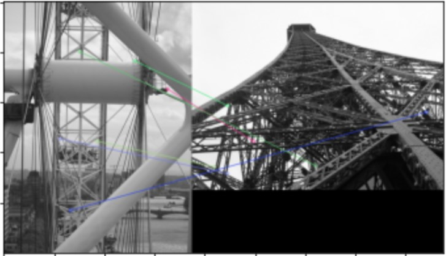
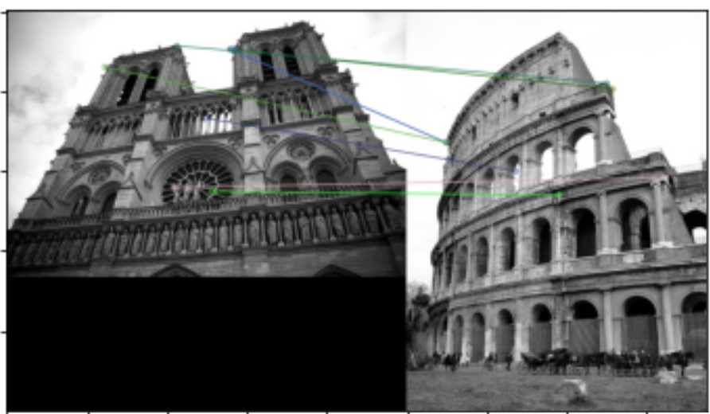
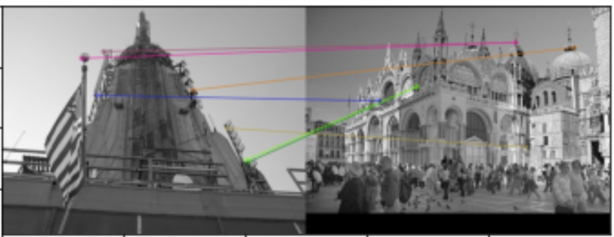

### Results
When tested with a k value of 10 which is the number of classes given in the test images folder, we achieve a pairwise clustering accuracy of 82.5%. It is calculated using the <code>
  calculate_accuracy</code> function.

# Part 2
## Transforming an Image
We used inverse warping with nearest neighbor interpolation to transform an image. We started with direct warping at first, but we noticed black streaks across our image because it was not a 1-to-1 mapping of pixels. 

The original image was

Using direct warping we get

But after applying inverse warping we get

## Estimating Transformation Matrix
Each matrix translation, rigid, affine, and projection can be found by solving a system of linear equations. We first found the coefficient matrix for each type of transformation then used numpy's built in linear equations solver to find the values of the transformation matrix. The coefficient matrices can be found below.

### Translation

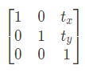

### Rigid

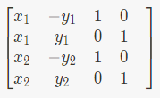

### Affine

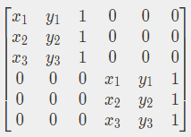

### Projection

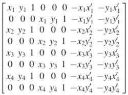

Using the coordinates given in the assignment, we were able to make book2.jpg appear as if it was seen from the same angle as book1.jpg

Book1.jpg | Book2.jpg             |  Results
:-------------------------:|:-------------------------:|:-------------------------:
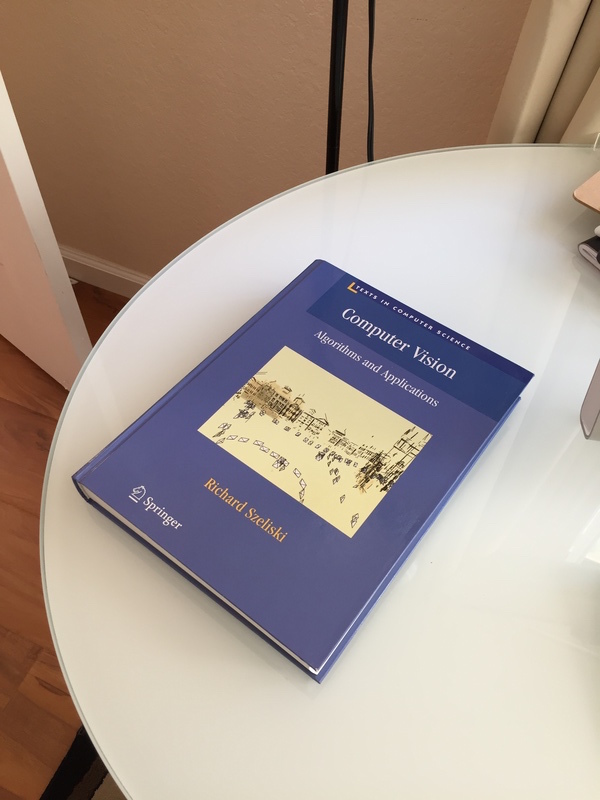 |   |  

# Part 3
## RANSAC Implementation
The RANSAC implementation involves choosing a random hypothesis, made from choosing 4 matching pairs of points found with the SIFT/ORB algorithm discussed in Part 1, estimating a translation matrix, then counting the number of other hypotheses that agree with it in a random subset of possible hypotheses. This implementation differs from the one discussed in class because we had to account for more than just translations. 

There are multiple caveats that come with different types of transformations. Besides complexity, each type of transformation requires us to account for 1 more point, so the number of possible hypotheses increases exponentially. For example, if we have a space of 200 keypoints found by part 1, and we need to solve for a translation, the space of possible hypotheses is 200. But when we go to a rigid transformation, requring 2 points, the space becomes (200 choose 2) = 19900. And with 4 points, (200 choose 4) = 64,684,950. It's infeasable to compare a hypothesis to every other hypothesis in a space. So, we had to compare each possible hypothesis to a subset of hypotheses. The subset was kept controlled for each hypothesis.

Our implementation works very well in a controlled environment for estimating translations, rigid transformations, and Affine transformations. Unfortunately, we only got abstract art for projections. For testing, we applied our own transformation to an image, ran the image through RANSAC and observed how close we got to the original transformation. Here are some results.

#### Translation
Before             |  After
:-------------------------:|:-------------------------:
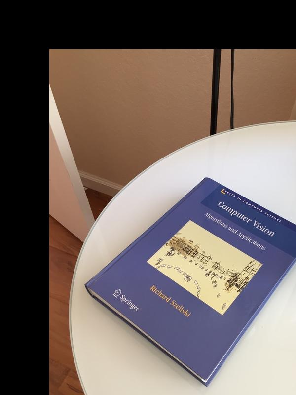  |  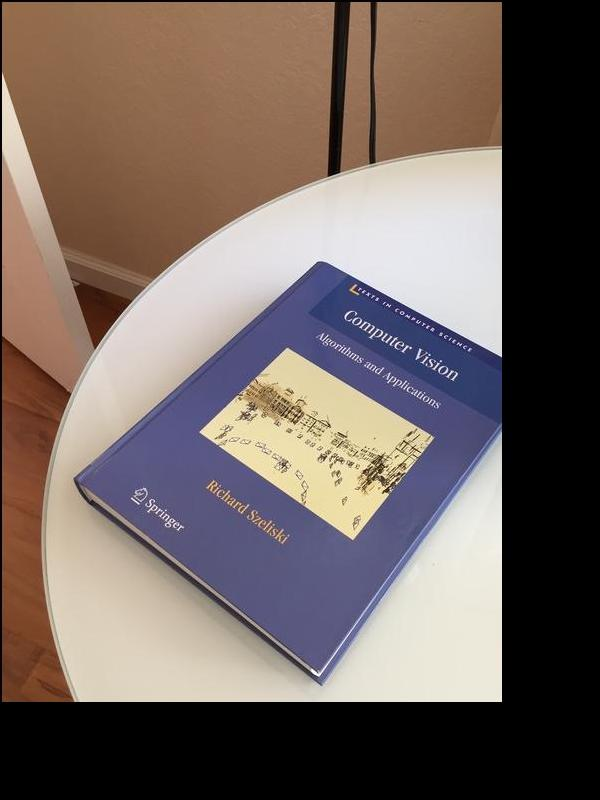

#### Translation + Rotation
Before             |  After
:-------------------------:|:-------------------------:
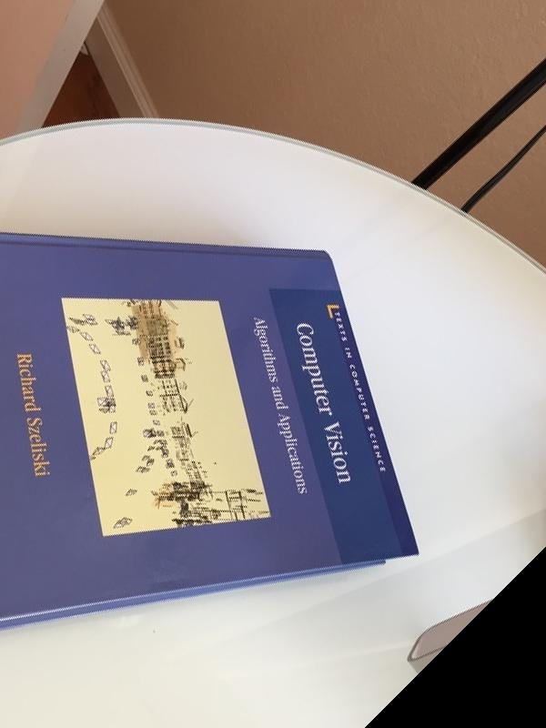  |  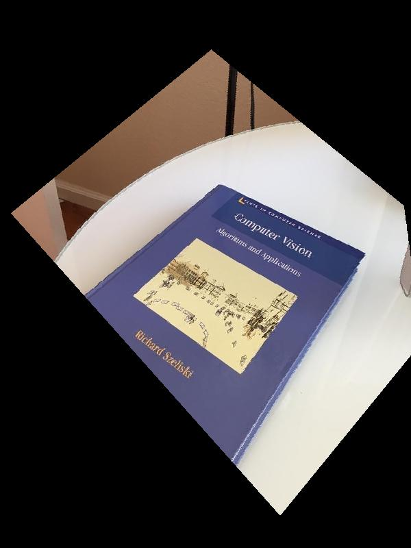

#### Projection Test
Before             |  After
:-------------------------:|:-------------------------:
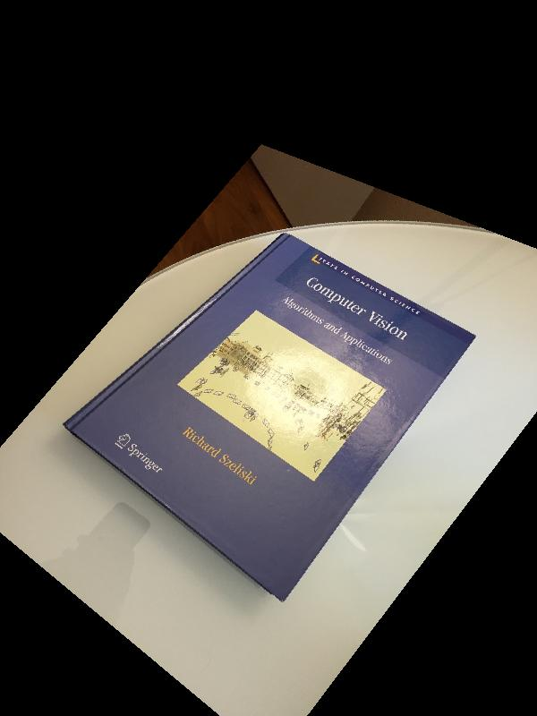  |  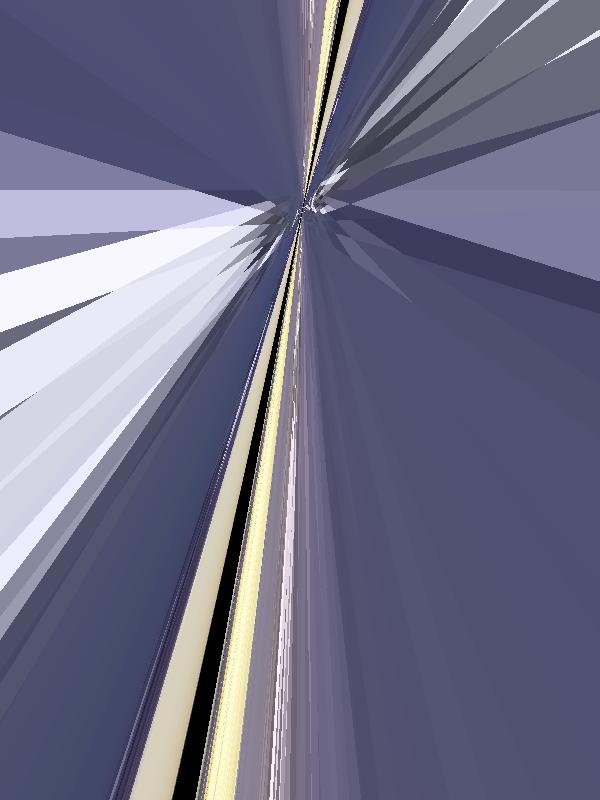

As we can see, projections aren't working. And, as a result, our implementation was hopeless at discovering any real world projections. Why might this be?

Well to start, let's think about the images with Big Ben. All four faces of the tower look the same, except each image might have the hand of the clocks in different locations. If our SIFT algorithm sees the hands as keypoints, then we might get an unwanted rotation in our estimated because the hands are in different positions at different parts of the day. Likewise, all the sides to big ben look similiar, so our algorithm could easily match the wrong sides. In any case, the transformation matrix is very sensitive to incorrect keypoints. Obviously, this is a very hard problem.

## References

The following sources were referred to for part 1:
- https://stackoverflow.com/questions/47321133/sklearn-hierarchical-agglomerative-clustering-using-similarity-matrix
- https://docs.opencv.org/4.x/dc/dc3/tutorial_py_matcher.html

## Contribution of the authors

- pchakila: Develop part 1 and utilities.py.
- ddoppala: Research and develop part 1 and its report.
- marcskin: Research and develop part 2 and 3.
